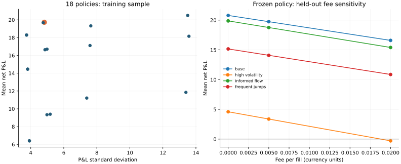

# Inventory control: profit, risk and model uncertainty

**Research question:** does inventory-dependent quoting improve the profit/risk
trade-off after trading costs, and does that conclusion survive changes in the
simulated market?

This is a synthetic model study, not a backtest on observed market data.
Implemented and tested with Codex assistance. All results are reproducible.

## Reproduce

```bash
python -m quant_research.inventory_study
python -m quant_research.make_report
python -m pytest -q
```

The numerical study needs NumPy; rendering the chart also needs Matplotlib.
`results.json` records every parameter, sample size and candidate score.

## Protocol fixed before evaluation

- Candidate grid: 3 half-spreads x 3 inventory skews x 2 position limits = 18 policies.
- Training: 1,000 paths, seed 101. Rank by mean P&L minus 0.1 times P&L standard deviation.
- Validation: 1,000 independent paths, seed 202. Select one of the top three training policies.
- Evaluation: 2,000 new paths per regime, 500 steps per path, seeds 303–306.
- Freeze the policy before evaluating 4 regimes x 3 fees = 12 cases.
- Charge 0.005 currency units per execution during selection and 0.02 per unit
  to liquidate terminal inventory. Evaluation fees: 0, 0.005 and 0.02.
- Reuse random paths across policies within each comparison. Costs do not feed
  back into quotes. Report paired mean differences and approximate 95% CIs.

The comparison policy has the **same spread and position limit**, with skew
set to zero. The separate wide-limit reference changes several parameters and
cannot isolate inventory skew. The objective's 0.1 risk penalty is a modelling
choice, not a universal investor preference, and is not an annualised Sharpe ratio.

## Dealer and counterparty model

At step t, a dealer sees fair value S and inventory q, then quotes:

`reservation = S - skew * q`

`bid = reservation - half_spread; ask = reservation + half_spread`

The counterparty valuation is `S + informedness * next_move + noise`.
It buys above the ask or sells below the bid, subject to dealer inventory
limits. Only the counterparty sees a component of the next price move.
The dealer then marks its inventory at the new fair value. This deliberately
creates adverse selection: fills can precede unfavourable price changes.

Terminal P&L equals cash plus marked inventory, less liquidation cost.
Maximum drawdown measures the largest peak-to-trough decline in marked P&L,
including terminal liquidation. Expected shortfall is minus the average P&L
of the worst 5% of paths; it can be negative when that tail remains profitable.

## Held-out base case

Selected policy: half-spread **0.16**, skew **0.02**, limit **10**.

| Metric | Selected policy | Matched zero-skew control |
|---|---:|---:|
| Mean net P&L | 19.7442 | 20.5837 |
| P&L standard deviation | 4.8882 | 13.5469 |
| Loss frequency | 0.0005 | 0.0725 |
| 95% expected shortfall | -8.4136 | 11.3733 |
| Mean maximum drawdown | 3.0774 | 11.1920 |
| Mean maximum inventory | 5.2635 | 9.8175 |

The selected policy reduced P&L standard deviation by **63.9%** while reducing mean P&L by **4.1%**. The paired mean difference is **-0.840**, with 95% CI **[-1.364, -0.315]**. This supports a risk reduction with a profit cost in this model, not profit dominance.

## Stress cases at the selection fee

| Regime | Selected mean P&L | Control mean P&L | Selected SD | Control SD |
|---|---:|---:|---:|---:|
| base | 19.744 | 20.584 | 4.888 | 13.547 |
| high_volatility | 3.375 | 3.711 | 8.255 | 22.864 |
| informed_flow | 18.760 | 19.606 | 5.021 | 13.553 |
| frequent_jumps | 14.089 | 14.583 | 7.064 | 19.390 |



Left: each candidate is evaluated on the same training paths. This plot is
selection evidence, not held-out performance. Right: the frozen selected policy
on independent test paths. Fee cases within a regime reuse paths, so they are
correlated comparisons, not additional independent observations.

## What could invalidate the result?

1. The arrival/value mechanism, noise distribution and regime changes are
   invented. Independent random seeds prevent sample reuse; they do not validate
   the market model or establish generalisation to real order flow.
2. The dealer observes fair value directly. Real fair value is latent.
3. Unit orders, one potential fill per step, no queue priority, latency, partial
   fills, market impact, exchange tick constraints or competition.
4. Fees are flat per unit and do not change quoting behaviour. No funding costs.
5. The test suite verifies selected accounting identities, risk limits and
   split separation. Passing tests does not establish economic realism.
6. CIs describe Monte Carlo sampling error conditional on a selected policy and
   fixed model. They omit selection uncertainty, model error and simultaneous
   multiple-comparison adjustments. Do not cherry-pick one of the 12 cases.
7. A final inventory haircut is a simple liquidation assumption. It is not an
   executable liquidation model. Price dynamics are additive rather than a
   calibrated positive-price process.

## Interview discussion: explain these without reading the code

- **Why does a long position lower both quotes?** The dealer becomes more eager
  to sell and less eager to buy; it shifts its reservation price downward.
- **Why paired randomness?** Var(A-B) = Var(A) + Var(B) - 2 Cov(A,B). Positive
  covariance from shared market shocks can reduce comparison noise.
- **Why three samples?** Training narrows the search; validation selects; the
  untouched test sample estimates performance after selection. Repeatedly
  modifying the model after inspecting test results would consume that holdout.
- **Why isn't lower volatility enough?** Profit, tail loss, capital usage and
  the cost of the risk reduction all matter. A strategy that never trades has
  zero inventory risk but is not automatically useful.
- **Why match spread and limit?** Otherwise multiple controls change at once,
  so attributing the outcome specifically to skew would be unjustified.
- **How can this become a stronger empirical study?** Calibrate arrival and fill
  assumptions using properly licensed order-flow data; model queue position and
  costs; predefine a chronological validation protocol before testing.

## Independent extension exercises

1. Derive the zero-fee/paid-fee P&L identity and write it as a test.
2. Add a funding charge on inventory, then explain how the optimal skew changes.
3. Add a delayed dealer observation without letting future prices enter quotes.
4. Replace the terminal haircut with a simple depth-dependent liquidation model.
5. Explain why a confidence interval for profit is not an interval for future
   live returns, and why a positive mean does not imply statistical significance.
